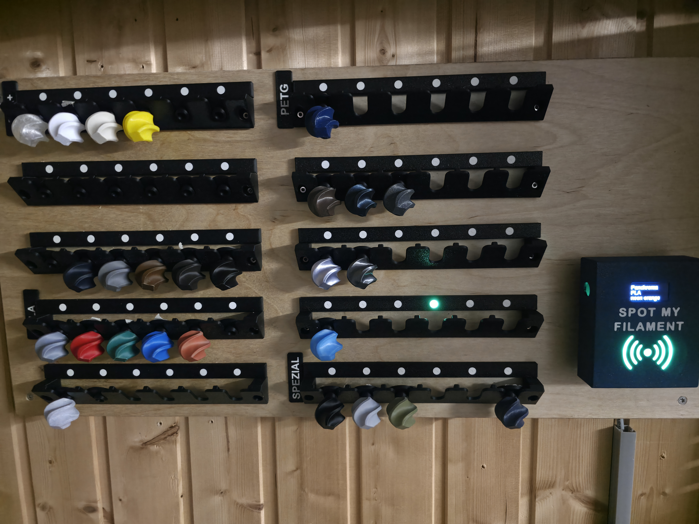
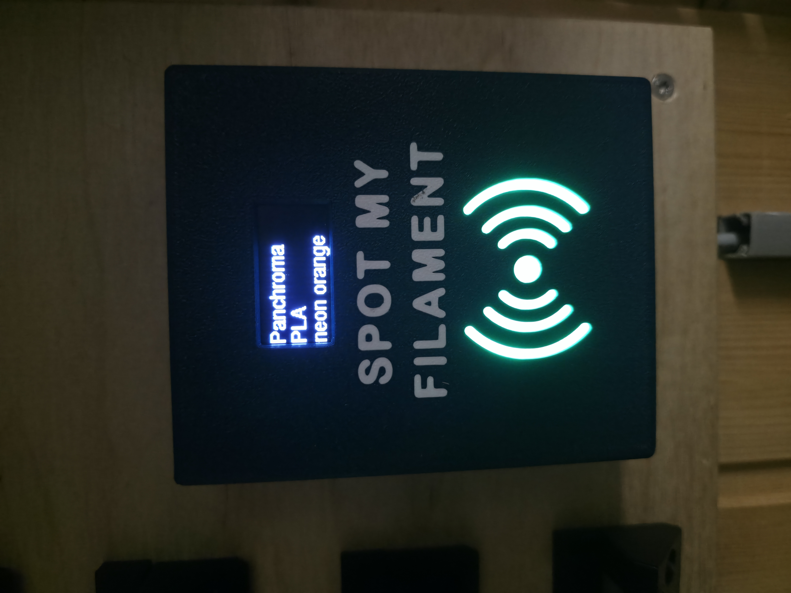
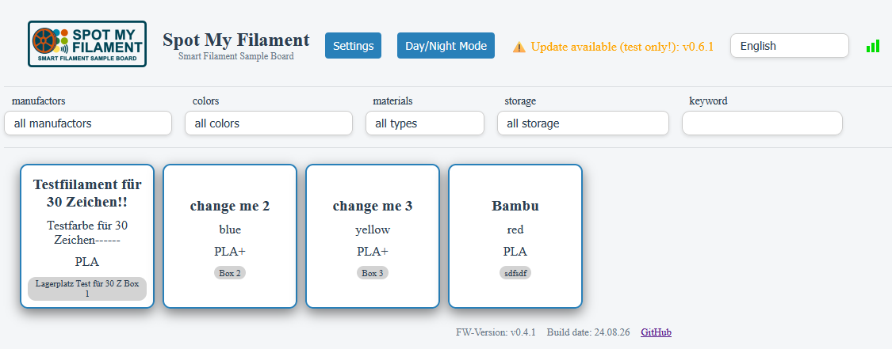
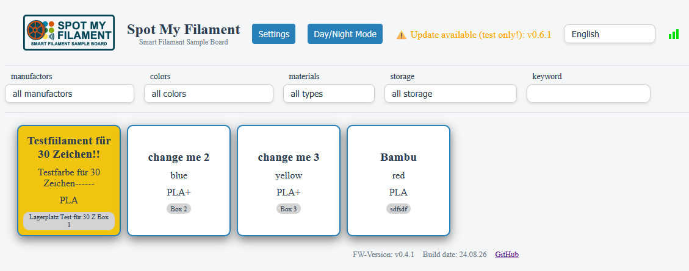

  

<h1 align="center">Smart Filament Sample Board</h1>

<i>Spot My Filament — finde jedes Filament-Sample per NFC-Tag auf einen Blick.</i>

  
  
  

---

## Inhaltsverzeichnis

<!-- - [Über das Projekt](#über-das-projekt) -->
- [Funktionsweise](#funktionsweise)
- [Benötigte Hardware](#benötigte-hardware)
- [Galerie](#galerie)
- [Erste Schritte](#erste-schritte)
- [Dokumentation](#dokumentation)
- [Mitmachen](#mitmachen)
- [Lizenz](#lizenz)

<!-- 
## Über das Projekt

TODO: 2-3 Sätze: Für wen ist das Board gedacht? Welches Problem löst es?
Beispiel:
Wer viele Filament-Sample-Spulen sammelt, kennt das Problem: Welches Sample war das
nochmal, und wo liegt es? Das Smart Filament Sample Board löst das mit NFC-Tags,
einem ESP32 und einer Home-Assistant-Anbindung — Tag scannen, LED zeigt den Lagerplatz. -->

## Funktionsweise

Workflow basierend auf einer eigenen JSON-Datenbank auf dem ESP32:

1. NFC-Tag wird über den NFC-Reader gelesen.
2. Der ESP32 fragt die Datenbank ab und stellt die Daten auf dem Display dar.
3. Die entsprechende LED leuchtet auf und zeigt den Lagerplatz des Samples an.
4. Ein Klick im WebIF zeigt ebenfalls, wo das Filament-Sample lagert.

Zusätzlich gibt es eine Anbindung an **Home Assistant** via HA-Discovery und MQTT:
Der ESP32 sendet das ausgewählte Filament (per NFC-Tag oder Klick im WebIF) an Home
Assistant. LEDs und Display lassen sich per HA ein-/ausschalten, der ESP übermittelt
den Status zurück.

## Benötigte Hardware

Siehe [Hardware-Dokumentation](./docs/hardware.md)

## Galerie

  
   
  Fertig aufgebautes Board

  
   
  Home-Assistant-Dashboard: Übersicht (links) und markiertes Sample (rechts)

## Erste Schritte

Kurzfassung — die ausführliche Anleitung steht in [`docs/setup.md`](docs/setup.md).

1. Hardware gemäß [`docs/hardware.md`](docs/hardware.md) verdrahten.
2. Firmware aus [`ESP32-Webserver`](ESP32-Webserver) auf den ESP32 flashen (siehe [`docs/setup.md`](docs/setup.md)).
3. WLAN-Zugangsdaten konfigurieren.
4. Optional: MQTT und Home-Assistant-Integration aktivieren (Auto-Discovery).
5. NFC-Tags anlegen und Filament-Samples zuordnen, siehe [`docs/usage.md`](docs/usage.md).

## Dokumentation

Ausführliche Anleitungen findest du im [`docs/`](docs) Ordner:

| Dokument | Inhalt |
|---|---|
| [`docs/hardware.md`](docs/hardware.md) | Verkabelung, Pinbelegung, Schaltplan |
| [`docs/setup.md`](docs/setup.md) | Firmware flashen, Konfiguration, Home-Assistant-Setup |
| [`docs/usage.md`](docs/usage.md) | Alltägliche Bedienung, NFC-Tags anlegen, WebIF |
| [`docs/3d-print.md`](docs/3d-print.md) | 3D-Druckteile aus [`3D-Daten`](3D-Daten), Druckeinstellungen |

<!-- Sammlung offener Notizen/Ideen liegt aktuell in Notes/ – ggf. dort verlinken -->

## Mitmachen

Contributions, Issues und Feature-Wünsche sind willkommen!
Schau gerne im [Issues-Tab](https://github.com/mark77-DE/Smart-Filament-Sample-Board/issues) vorbei.

<!-- TODO: falls gewünscht, CONTRIBUTING.md ergänzen und hier verlinken -->

## Lizenz

Dieses Projekt steht unter der [GPL-3.0 Lizenz](LICENSE).
