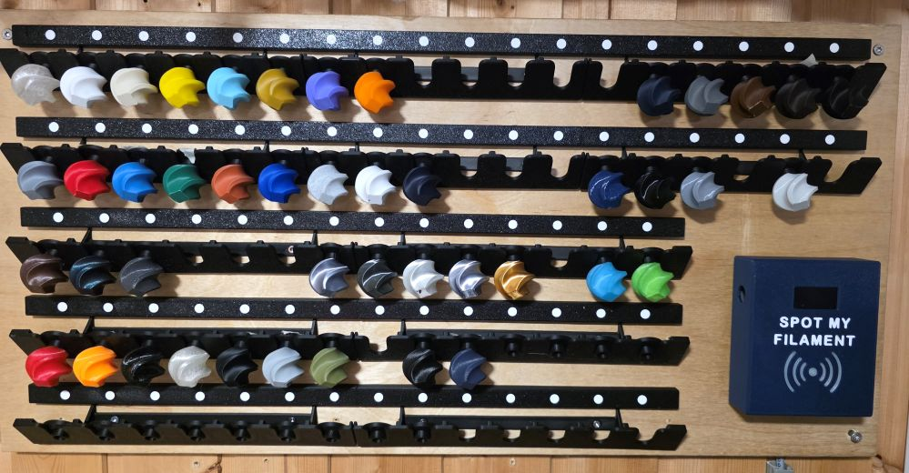
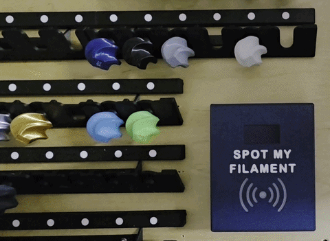

  

<h1 align="center">Smart Filament Sample Board</h1>

<i>Spot My Filament — find every filament sample at a glance using NFC tags.</i>

  
  
  

  🇩🇪 <a href="./README.md">Deutsch</a> &nbsp;|&nbsp; 🇬🇧 <strong>English</strong>

---

## Table of Contents

* [How It Works](#how-it-works)
* [Required Hardware](#required-hardware)
* [Gallery](#gallery)
* [Getting Started](#getting-started)
* [Documentation](#documentation)
* [Contributing](#contributing)
* [License](#license)

## How It Works

The workflow is based on a dedicated JSON database stored on the ESP32:

1. An NFC tag is scanned using the NFC reader.
2. The ESP32 looks up the corresponding entry in the database and displays the data on the display.
3. The corresponding LED lights up and indicates the storage location of the sample.
4. A click in the WebIF also shows where the filament sample is stored.

The board also integrates with **Home Assistant** via HA Discovery and MQTT:

The ESP32 sends the selected filament (via NFC tag or WebIF click) to Home Assistant. LEDs and the display can be switched on and off via HA, while the ESP32 reports its current status back to Home Assistant.

## Required Hardware

See the [Hardware Documentation](./docs/hardware.md).

## Gallery

  
    
   
  Completed Smart Filament Sample Board

  
   
  Home Assistant dashboard: overview (left) and selected sample (right)

## Getting Started

Quick start — see [`docs/setup.md`](docs/setup.md) for the complete setup guide.

1. Wire the hardware according to [`docs/hardware.md`](docs/hardware.md).
2. Flash the firmware from [`ESP32-Webserver`](ESP32-Webserver) to the ESP32 (see [`docs/setup.md`](docs/setup.md)).
3. Configure the Wi-Fi credentials.
4. Optional: Enable MQTT and the Home Assistant integration (Auto-Discovery).
5. Create NFC tags and assign them to filament samples, see [`docs/usage.md`](docs/usage.md).

## Documentation

Detailed documentation can be found in the [`docs/`](docs) folder:

| Document                               | Content                                                        |
| -------------------------------------- | -------------------------------------------------------------- |
| [`docs/hardware.md`](docs/hardware.md) | Wiring, pin assignment, schematic                              |
| [`docs/setup.md`](docs/setup.md)       | Flashing the firmware, configuration, Home Assistant setup     |
| [`docs/usage.md`](docs/usage.md)       | Daily operation, creating NFC tags, WebIF                      |
| [`docs/3d-print.md`](docs/3d-print.md) | 3D-printable parts from [`3D-Daten`](3D-Daten), print settings |

<!-- Collection of open notes/ideas is currently located in Notes/ – link here if desired -->

## Contributing

Contributions, issues, and feature requests are welcome!

Feel free to check out the [Issues tab](https://github.com/mark77-DE/Smart-Filament-Sample-Board/issues).

<!-- TODO: Add and link CONTRIBUTING.md if desired -->

## License

This project is licensed under the [GPL-3.0 License](LICENSE).
