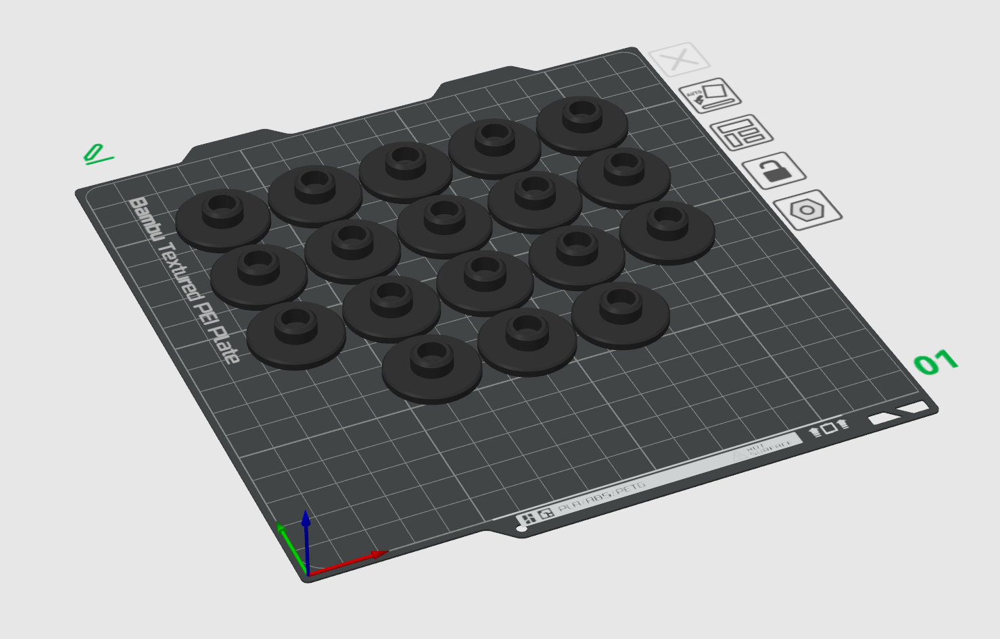
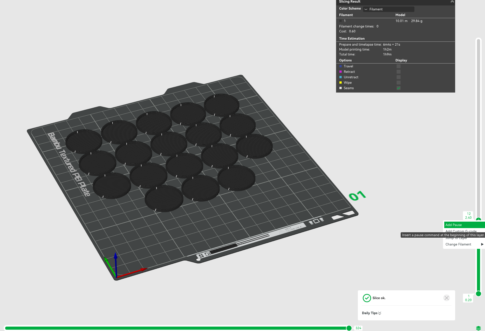
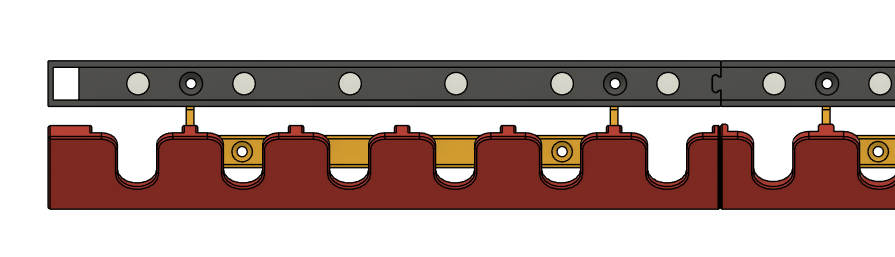
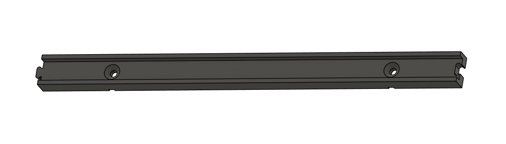
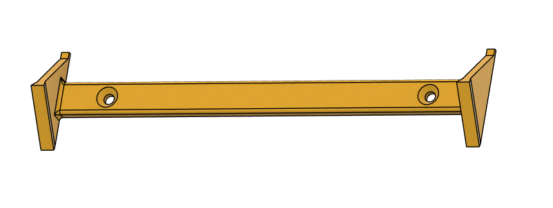
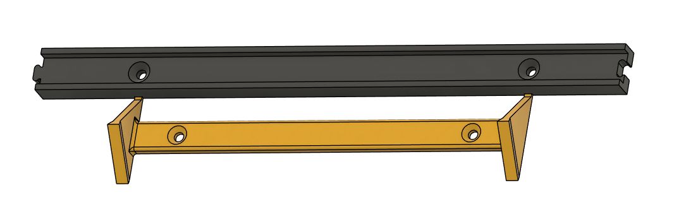

# WORK IN PROGRESS

# 3D-Druckteile

Alle 3D-Druckdateien liegen im Ordner [`3D-Daten`](../3D-Daten).

Die 6er Version lässt sich noch auf dem A1-Mini drucken.

## Dateiübersicht

| Dateiname | Info |
|---|---|
| Filament-Sample-Board_6x.3mf | Komplettpaket eine Zeile 3x6 Halter |
| Filament-Sample-Board_7x.3mf | Komplettpaket eine Zeile 3x7 Halter |
| ModifiedSample.3mf | Das bekannte sSample mit verkürztem Fuß |
| Sample_Fuss.3mf | Ser Fuß für die Samples |

## Wichtige Druckeinstellungen

Der Fuß benötigt eine Druckpause bei Layer 12 bzw. 2,4mm Höhe.
An der Stelle wird das NFC-Tag eingelegt und am Besten mit seiner Klebefolie eingeklebt, damit es sich im Druck nicht verschiebt.

  
   
  Print Pause

## Montagehinweise

Die LED Halter haben "Puzzle-Nasen", damit sie aneinadergereiht werden können.
Außerdem haben sie kleine Aussparung an der Unterseite, damit der Halter für den Träger besser ausgerichtet werden kann.

<table align="center">
  <tr>
    <td align="center">
       
      Puzzle Nase
    </td>
    <td align="center">
       
      Aussparung LED-Halter
    </td>
  </tr>
</table>

<table align="center">
  <tr>
    <td align="center">
       
      Nase Träger
    </td>
    <td align="center">
       
      ausgerichtet
    </td>
  </tr>
</table>

