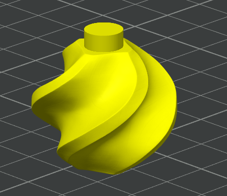

# 3D-Druckteile

Alle 3D-Druck- bzw. .step-Dateien liegen im Ordner [`3D-Daten`](../3D-Daten/).

Die 6er Version lässt sich noch auf dem A1-Mini drucken.

### Aktuell gibt es nur 6er und 7er Varianten, 4er und 5er sind in Planung.

## Dateiübersicht

| Dateiname | Info |
|---|---|
| [Filament-Sample-Board_6x.3mf](../3D-Daten/Printfiles/Filament-Sample-Board_6x.3mf) | Komplettpaket eine Zeile 3x6 Halter |
| [Filament-Sample-Board_7x.3mf](../3D-Daten/Printfiles/Filament-Sample-Board_7x.3mf) | Komplettpaket eine Zeile 3x7 Halter |
| [ModifiedSample.3mf](../3D-Daten/Printfiles/ModifiedSample.3mf) | Das bekannte Sample mit verkürztem Fuß |
| [Sample_Fuss.3mf](../3D-Daten/Printfiles/Sample_Fuss.3mf) | Der Fuß für die Samples |

## Wichtige Druckeinstellungen

Der Fuß benötigt eine <b>Druckpause bei Layer 12 bzw. 2,4mm Höhe.</b>
An der Stelle wird das NFC-Tag eingelegt und am Besten mit <b>seiner Klebefolie eingeklebt</b>, damit es sich im Druck nicht verschiebt.

  
   
  Print Pause

Das Sample selbt sollte mit <b>0,16mm Layerhöhe</b> gedruckt werden, da die Farben besser zur Geltung kommen.

   
  Sample

## Montagehinweise

Die Teile sind untereinander kompatibel. 
Die LED Halter haben "Puzzle-Nasen", damit sie aneinadergereiht werden können. 
Außerdem haben sie kleine Aussparung an der Unterseite, damit der Halter für den Träger besser ausgerichtet werden kann.

<table align="center">
  <tr>
    <td align="center">
       
      Puzzle Nase
    </td>
    <td align="center">
       
      Aussparung LED-Halter
    </td>
  </tr>
</table>

<table align="center">
  <tr>
    <td align="center">
       
      Nase Träger
    </td>
    <td align="center">
       
      ausgerichtet
    </td>
  </tr>
</table>

