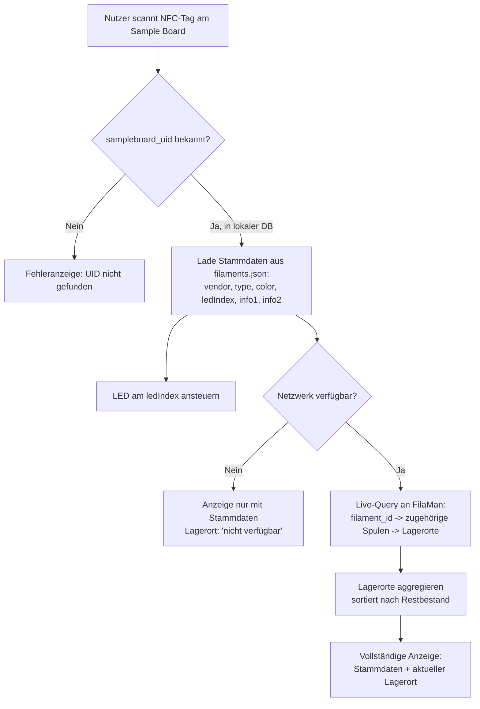
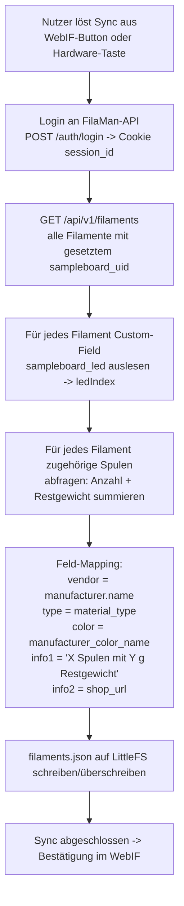
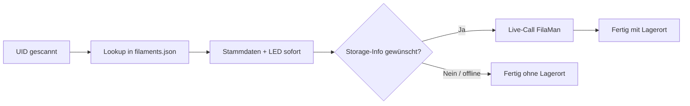

# Workflow: Lokale DB (filaments.json) vs. FilaMan-DB

Diese Seite beschreibt, wann das Smart Filament Sample Board auf die **lokale
`filaments.json`** (LittleFS) zugreift und wann es live gegen die
**FilaMan-API** abfragt — inklusive Sync-Mechanismus.

## Grundprinzip

| | Lokale DB (`filaments.json`) | FilaMan-DB (live) |
|---|---|---|
| Quelle | LittleFS auf dem ESP32 | FilaMan-Server (`server-ip:port`) |
| Inhalt | vendor, type, color, ledIndex, info1 (Bestand), info2 (Shop-URL) | Alle Felder inkl. `storage` (Lagerort) |
| Aktualisierung | Manuelle Pflege per WebIF | Immer aktuell (Live-Abfrage) |
| Geschwindigkeit | Sehr schnell (lokal) | Abhängig von Netzwerk/API-Latenz |
| Warum getrennt? | Stabile Stammdaten, selten geändert | Lagerort ändert sich häufig (AMS/Bambuddy-Zuordnung) und wäre in lokaler DB schnell veraltet |

Der Lagerort (`storage`) wird bewusst **nicht** synchronisiert, sondern immer
live abgefragt, da er sich zu oft ändert.

## Workflow 1: NFC-Scan am Sample Board (Nutzung)

**Kernidee:** Die lokale DB liefert sofort die stabilen Anzeigedaten und
steuert die LED, unabhängig vom Netzwerk. Der Lagerort wird nur bei
Bedarf live nachgeladen und ergänzt die Anzeige, sobald er verfügbar ist.

## Workflow 2: Sync der lokalen DB (Wartung)

**Wichtig:** Der Sync läuft **nicht automatisch** bei jedem Boot, sondern nur
auf explizite Nutzeranforderung, um unnötige API-Last und Inkonsistenzen zu
vermeiden.

## Entscheidungslogik im Code (Kurzfassung)

## Offene Punkte

- Workaround für den FilaMan-Bug bei der Custom-Field-Suche auf
  `/api/v1/filaments` bleibt bestehen, bis der Fix im Upstream-Projekt
  gemergt ist.
