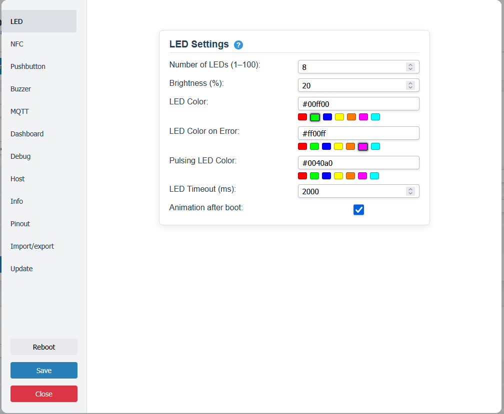
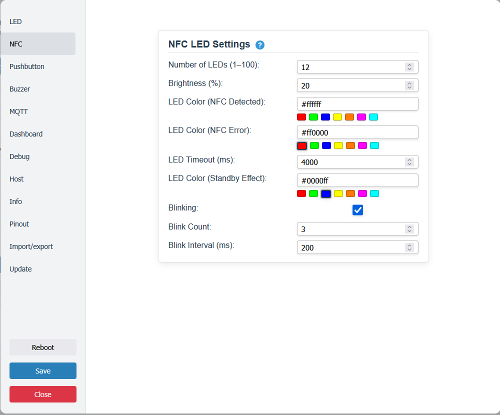
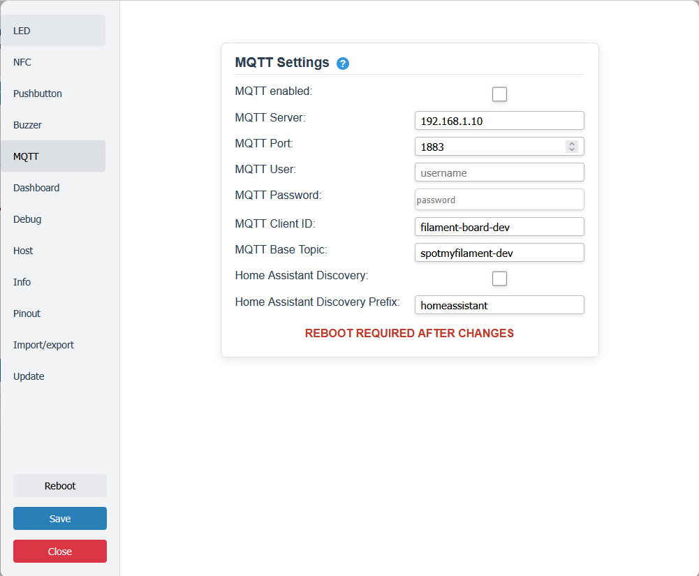
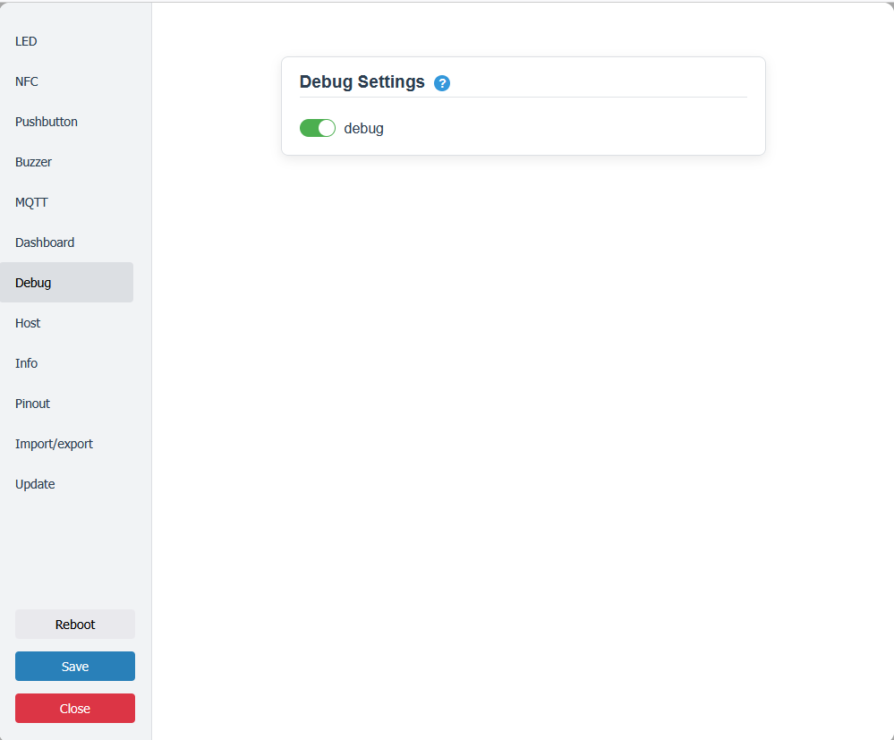

# Setup & Konfiguration

Diese Anleitung beschreibt, wie die Firmware aufgespielt und das Board eingerichtet wird.

## Installation
### 1. Möglichkeit: Webinstaller
[webinstaller](https://mark77-de.github.io/Smart-Filament-Sample-Board/webinstaller/)
Dort auswählen, welches Display man nutzen möchte.
Aktuell SSD1306 OLED, SH1106 OLED oder ST7789 TFT. 
Details unter [hardware](./hardware.md)

### 2. Möglichket: .bin herunterladen und flashen
Diese liegen hier: [Releases](https://github.com/mark77-DE/Smart-Filament-Sample-Board/releases)

### 3. Möglichkeit: Repo clonen und selbst kompilieren und flashen

## Setup (nur die Basics)
### 1. Start
Beim ersten Start wird nachden WLAN-Setting gefragt, dazu öffnet der ESP einen Hotspot mit der SSID "SpotMyFilament".
Hier verbinden und die IP Adresse 192.168.4.1 im Browser eintragen und die eigenen WLAN-Daten eintragen und speichern.

### 2. LEDs konfigurieren
Hier sollte die Anzahl der LEDs konfiguriert werden. Diese sollte der Anzahl der Plätze für Samples entsprechen.

   
  LEDs konfigurieren

### 3. NFC-LEDs konfigurieren
Hier sollte die Anzahl der LEDs 12 bleiben, wenn die 3D-Druckteile aus dem Repo benutz werden.

   
  NFC-LEDs konfigurieren

### 4. optional MQTT konfigurieren

   
  MQTT konfigurieren

<b>Werden hier Einstellungen gemacht, muss ein Neustart erfolgen</b>

## Troubleshooting

   
  Debug (de)aktivieren

Ausgabe der Debug Daten über die serielle Schnittstelle.

<!-- TODO: häufige Probleme, z. B.
- NFC-Reader wird nicht erkannt → Verkabelung/Adresse prüfen
- Keine MQTT-Verbindung → Broker-IP/Zugangsdaten prüfen
-->
