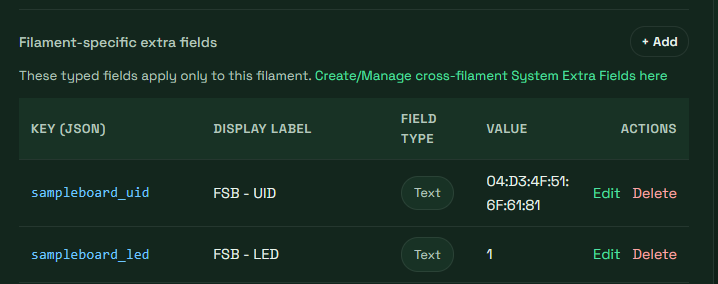
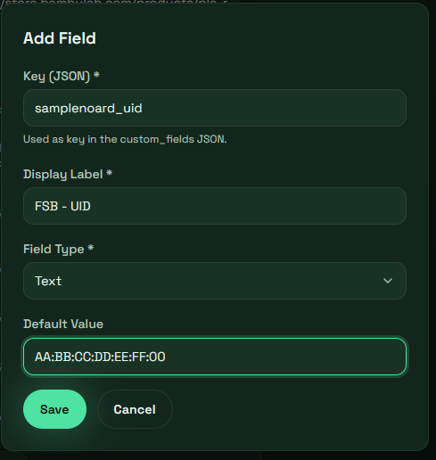

# Bedienung bei Anbindung an Filaman

## NFC-Tags anlegen

1. Im Filaman WebIf die Seite Filamente öffnen.
2. Für jede Farbe, für die man ein Sample anlegen möchte, benötigt das Filament 2 filamentspezifische Extrafelder.

  
  

3. Die Keys **müssen zwingend** `sampleboard_uid` und `sampleboard_led` sein.
4. `sampleboard_uid` bekommt die UID des Sample-NFC-Tags.
5. `sampleboard_led` bekommt die zugeordnete LED auf deinem Board.
6. Im FSB WebIf unter Einstellungen → Filaman die Zugangsdaten eintragen (vorher z. B. einen Nutzer mit nur Leseberechtigung in Filaman anlegen).
7. Im FSB WebIf unter Einstellungen → Sync Filaman ausführen. Das kann je nach DB-Größe (entscheidend ist die Anzahl der Filamente, nicht der Spulen) eine Weile dauern.
## Sample per NFC-Tag finden

NFC-Tag an den Leser halten, FSB zeigt auf dem Display, Hersteller, Typ und Farbe aus den eben synchronisierten Daten und fragt zusätzlich bei Filaman den Lagerplatz ab.

## Sample über das WebIF finden

1. WebIF im Browser öffnen: `http://<ip-des-boards>/`
2. Filament in der Liste auswählen und anklicken.
3. Die passende LED am Board leuchtet auf, um den Sample-Lagerplatz zu markieren.

  

4. Das FSB fragt die Filam DB ab und aktualisiert den Lagerort im WebIf.

## Steuerung über Home Assistant

- LEDs und Display lassen sich per Home Assistant ein-/ausschalten. (z.B. schalten per Bewegungssensor)
- Der ESP32 übermittelt den aktuellen Status (z. B. ausgewähltes Filament) an Home Assistant zurück. (z.B. Sprachausgabe)

## Sample bearbeiten / löschen

Dazu passende UID im Filaman löschen und erneut synchronisieren.

## Sonstiges

<b>Filtern:</b> durch Eingabe von Filterwörtern kann gesucht werden, wird im Material Filter z.B. PLA ausgeählt, leuchten alle PLA Samples.
<b>Sortieren:</b> durch Klick auf den kategorienamen wird auf- bzw. absteigend gefiltert.
