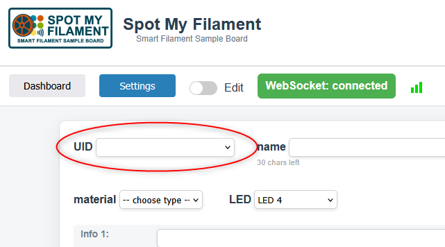
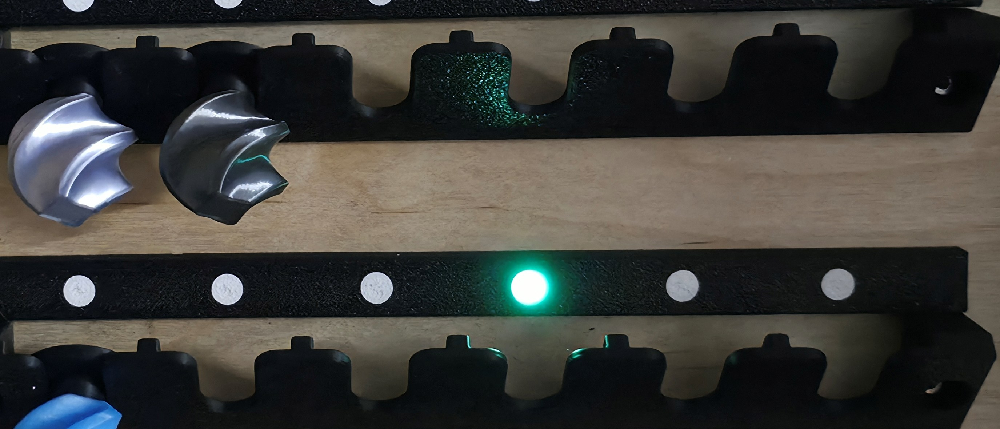

# Bedienung

## NFC-Tags anlegen

<!-- TODO: konkreten Ablauf beschreiben, z. B.
1. Neuen NFC-Tag an den Reader halten
2. Im WebIF unter "Neues Sample" die Tag-ID erfassen
3. Filament-Details eintragen (Hersteller, Material, Farbe, Lagerplatz)
-->
1. Im WebIf die Seite Settings öffnen
2. NFC-Tag an den Reader halten, der Tag wid automatisch eingetragen

  

3. die restlichen Informationen zum Sample eintragen, <b>UID, name, color, material und LED sind Pflichtfelder</b>, der Rest ist optional 
4. Es können nur LEDs ausgewählt werden, die noch nicht vergeben sind. Wird eine LED ausgewählt, leuchtet diese entsprechend auf dem Board kurz auf zur Orientierung. 

  

## Sample per NFC-Tag finden

1. NFC-Tag an den Reader halten.
2. Der ESP32 fragt die Datenbank ab und zeigt die Filament-Infos auf dem Display an.
3. Die LED am zugehörigen Sample-Lagerplatz leuchtet auf.
4. Die entsprechende Kachel im WebIF leuchtet auch auf.

## Sample über das WebIF finden

1. WebIF im Browser öffnen: `http://<ip-des-boards>/`
2. Filament in der Liste auswählen und anklicken.
3. Die passende LED am Board leuchtet auf, um den Sample-Lagerplatz zu markieren.

  

## Steuerung über Home Assistant

- LEDs und Display lassen sich per Home Assistant ein-/ausschalten. (z.B. schalten per Bewegungssensor)
- Der ESP32 übermittelt den aktuellen Status (z. B. ausgewähltes Filament) an Home Assistant zurück. (z.B. Sprachausgabe)
- <!-- TODO: Beispiel-Dashboard-Card / Automatisierung verlinken, falls vorhanden -->

## Sample bearbeiten / löschen

<!-- TODO: Ablauf im WebIF beschreiben -->
Um ein Sample zu bearbeiten oder zu löschen, muss der Schalter "bearbeiten" aktiv sein

## Sonstiges

<b>Filtern:</b> durch Eingabe von Filterwörtern kann gesucht werden, wird im Material Filter z.B. PLA ausgeählt, leuchten alle PLA Samples.
<b>Sortieren:</b> durch Klick auf den kategorienamen wird auf- bzw. absteigend gefiltert.
